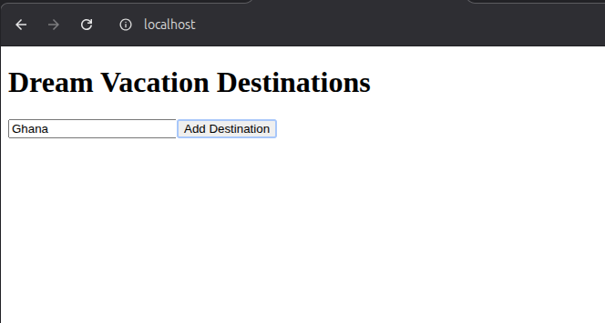
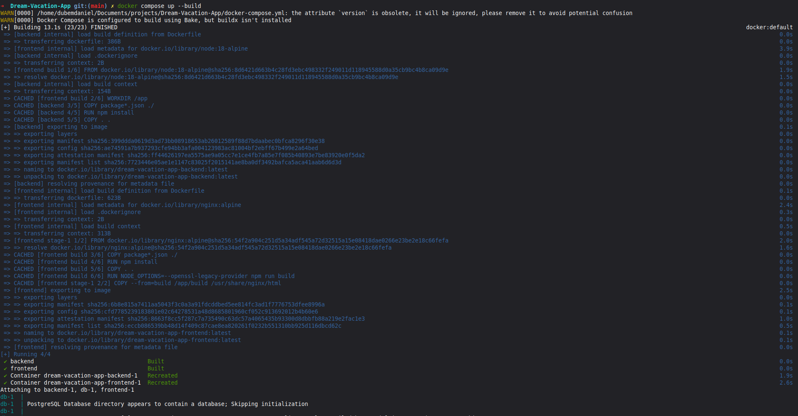

# Dream Vacation App — Dockerized

A full-stack web application containerized with Docker and Docker Compose.

## Project Structure

Dream-Vacation-App/
│
├── frontend/ # React app served with nginx
│ └── Dockerfile
├── backend/ # Node.js/Express API
│ └── Dockerfile
├── docker-compose.yml
├── .env
└── README.md

## How to Run

**1. Clone the repo**

```bash
git clone https://github.com/YOUR-USERNAME/Dream-Vacation-App.git
cd Dream-Vacation-App
```

**2. Start all containers**

```bash
docker compose up --build
```

**3. Open the app**
http://localhost

**4. Stop the app**

```bash
docker compose down
```

## Services

| Service  | Description               | Port |
| -------- | ------------------------- | ---- |
| frontend | React app served by nginx | 80   |
| backend  | Node.js API server        | 3001 |
| db       | PostgreSQL database       | 5432 |

##  Screenshots

### App Running in Browser



_The Dream Vacation Destinations app running at localhost after docker compose up._

### Docker Containers Running



_All three containers (frontend, backend, db) running successfully._

## Environment Variables

Stored in `.env` file:

POSTGRES_USER=postgres
POSTGRES_PASSWORD=postgres
POSTGRES_DB=dreamvacation
DATABASE_URL=postgresql://postgres:postgres@db:5432/dreamvacation
