# Dream Vacation App — Dockerized

A full-stack web application containerized with Docker and Docker Compose.

## Project Structure

Dream-Vacation-App/
│
├── frontend/ # React app served with nginx
│ └── Dockerfile
├── backend/ # Node.js/Express API
│ └── Dockerfile
├── docker-compose.yml
├── .env
└── README.md

## How to Run

**1. Clone the repo**

```bash
git clone https://github.com/YOUR-USERNAME/Dream-Vacation-App.git
cd Dream-Vacation-App
```

**2. Start all containers**

```bash
docker compose up --build
```

**3. Open the app**
http://localhost

**4. Stop the app**

```bash
docker compose down
```

## Services

| Service  | Description               | Port |
| -------- | ------------------------- | ---- |
| frontend | React app served by nginx | 80   |
| backend  | Node.js API server        | 3001 |
| db       | PostgreSQL database       | 5432 |

##  Screenshots

### App Running in Browser

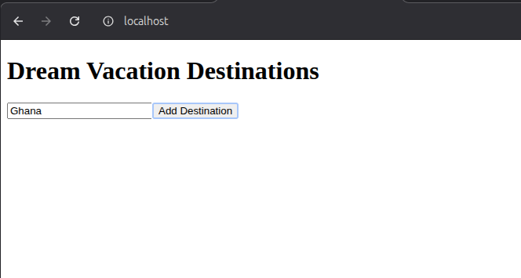

_The Dream Vacation Destinations app running at localhost after docker compose up._

### Docker Containers Running

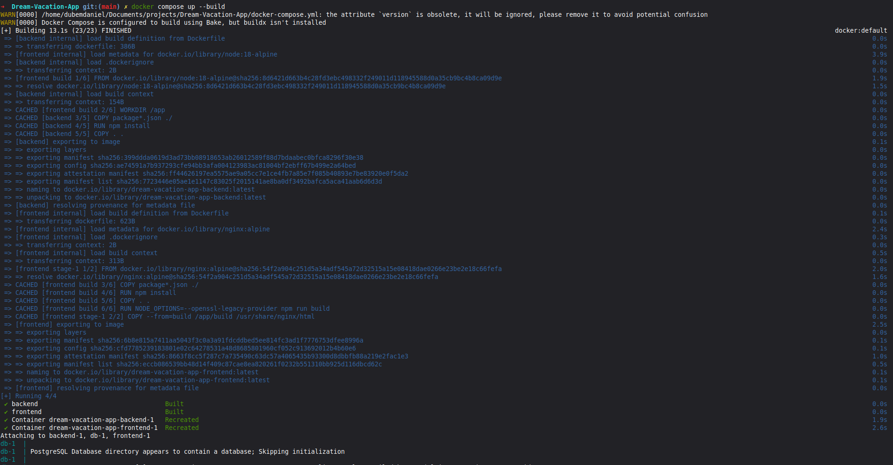

_All three containers (frontend, backend, db) running successfully._

## Environment Variables

Stored in `.env` file:

POSTGRES_USER=postgres
POSTGRES_PASSWORD=postgres
POSTGRES_DB=dreamvacation
DATABASE_URL=postgresql://postgres:postgres@db:5432/dreamvacation


##  CI/CD Pipeline

This project uses GitHub Actions to automatically build and push Docker images to Docker Hub on every push to `main` or `dev`.

### How it works

1. You push code to GitHub
2. GitHub Actions automatically triggers
3. It builds the Docker image for that service
4. It pushes the image to Docker Hub with two tags:
   - `latest` — always the most recent build
   - `<commit-sha>` — unique tag for that specific push

### Workflow files

| File | What it does |
|---|---|
| `.github/workflows/backend.yml` | Builds and pushes the backend image |
| `.github/workflows/frontend.yml` | Builds and pushes the frontend image |

### Secrets required

| Secret | Description |
|---|---|
| `DOCKER_USERNAME` | Your Docker Hub username |
| `DOCKER_TOKEN` | Your Docker Hub access token |

### Docker Hub Images

- `dubemdaniel/dream-vacation-backend`
- `dubemdaniel/dream-vacation-frontend`

##  AWS Deployment

The app is deployed to an AWS EC2 instance using the CI/CD pipeline.

### AWS Infrastructure

| Resource | Name | Details |
|---|---|---|
| VPC | dream-vpc | CIDR: 10.0.0.0/16 |
| Subnet | dream-subnet | CIDR: 10.0.1.0/24, us-east-1a |
| Internet Gateway | dream-igw | Attached to dream-vpc |
| Route Table | dream-rt | Associated with dream-subnet |
| EC2 Instance | dream-server | Ubuntu 24.04, t3.micro |
| Security Group | dream-sg | Ports: 22, 80, 3001 |

### Live App
Visit: http://13.222.19.192

### Screenshots

#### VPC
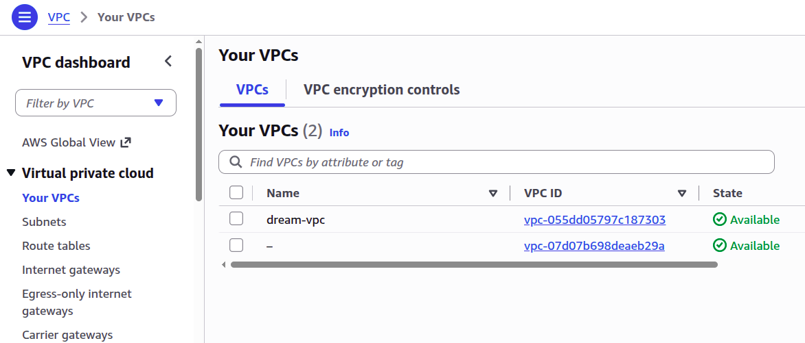

*Custom VPC created for the Dream Vacation App.*

#### Subnet
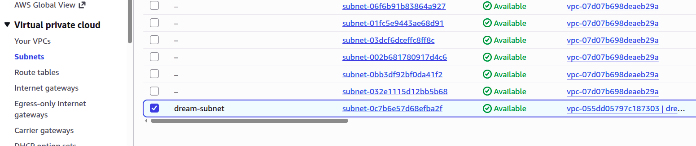

*Public subnet inside the VPC in us-east-1a availability zone.*

#### EC2 Instance Running
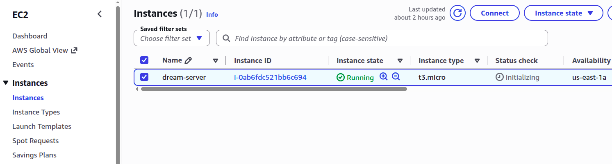

*EC2 instance running Ubuntu 24.04 with Docker installed.*

#### App Deployed on EC2
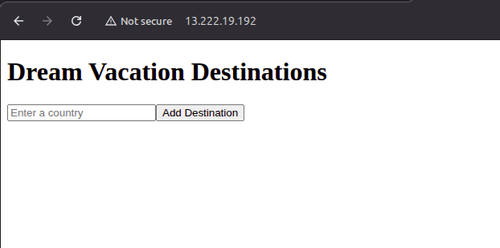

*Dream Vacation App running live on the EC2 public IP.*

#### CI/CD Pipeline Success
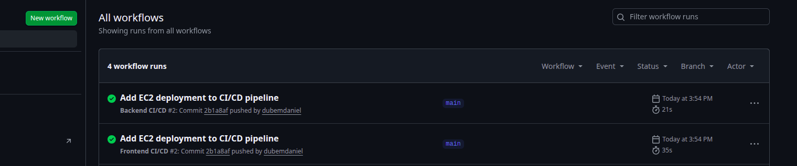

*GitHub Actions pipeline successfully building and deploying to EC2.*

### How Deployment Works

Every time code is pushed to `main`:
1. GitHub Actions builds the Docker images
2. Pushes them to Docker Hub
3. SSHs into the EC2 instance
4. Pulls the latest code
5. Restarts the containers with docker-compose


## Terraform Deployment (Stage 7)

Infrastructure is provisioned using Terraform (Infrastructure as Code).

### Terraform Files

| File | What it does |
|---|---|
| `terraform/main.tf` | Creates VPC, Subnet, IGW, Route Table, Security Group, EC2, CloudWatch |
| `terraform/variables.tf` | Defines reusable variables |
| `terraform/outputs.tf` | Outputs EC2 IP, VPC ID, Subnet ID after apply |

### How to Deploy Infrastructure

```bash
cd terraform
terraform init
terraform plan
terraform apply
```

### What Terraform Creates

| Resource | Name | Details |
|---|---|---|
| VPC | dream-vpc | CIDR: 10.0.0.0/16 |
| Subnet | dream-subnet | CIDR: 10.0.1.0/24, us-east-1a |
| Internet Gateway | dream-igw | Attached to dream-vpc |
| Route Table | dream-rt | Routes traffic to internet |
| EC2 Instance | dream-server | Ubuntu 24.04, t3.micro |
| Security Group | dream-sg | Ports: 22, 80, 3001 |
| CloudWatch Alarm | dream-cpu-alarm | Triggers when CPU > 80% |

### Screenshots

#### VPC (created by Terraform)
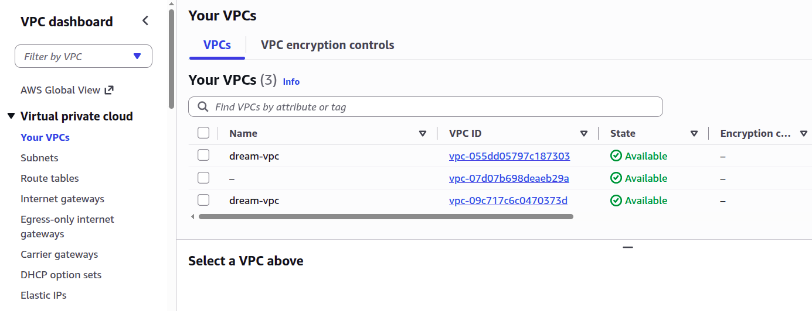

*VPC created automatically by Terraform.*

#### Subnet (created by Terraform)
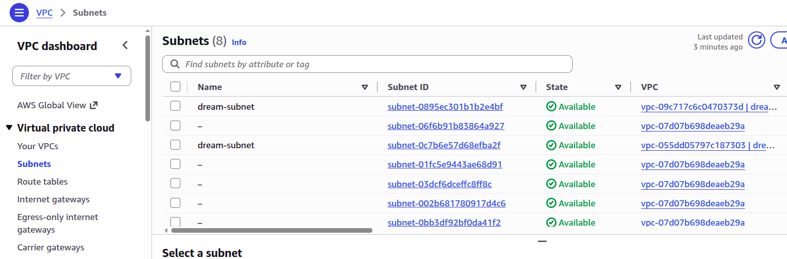

*Public subnet in us-east-1a created by Terraform.*

#### EC2 Instance Running
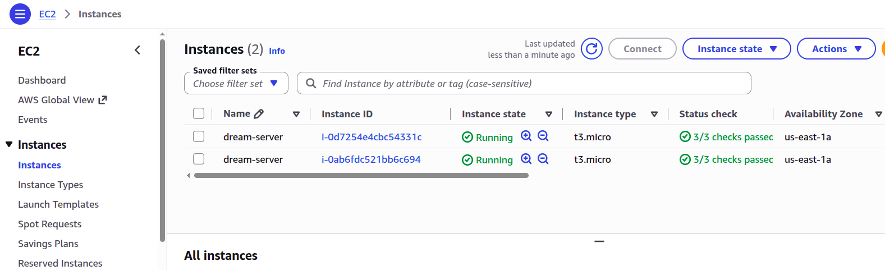

*EC2 instance provisioned by Terraform running Ubuntu 24.04.*

#### App Deployed
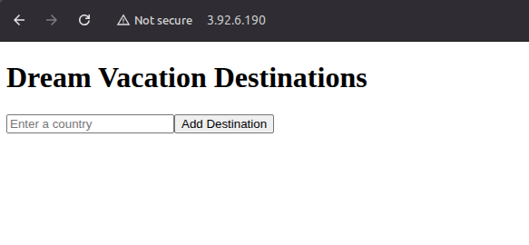

*Dream Vacation App running on the Terraform-provisioned EC2 instance.*

#### CloudWatch CPU Alarm
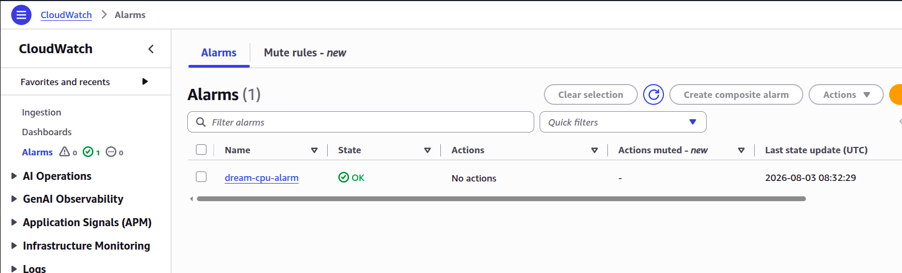

#### CI/CD Pipeline Success (with Terraform)
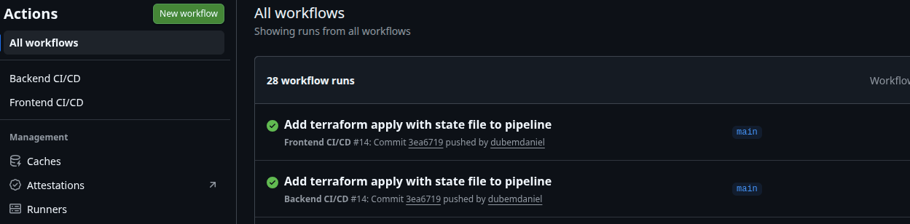

*GitHub Actions pipeline showing successful build, Terraform plan, and deployment to EC2.*

*CloudWatch alarm monitoring CPU utilization on the EC2 instance.*